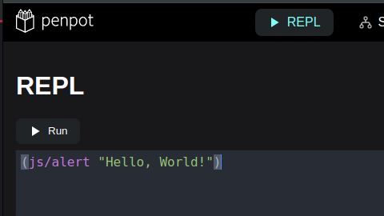
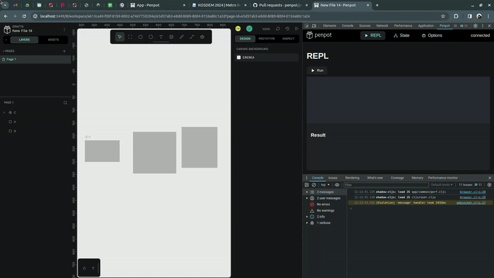
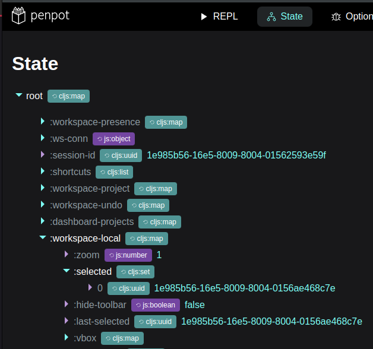
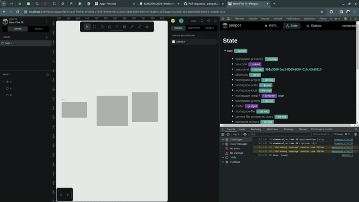
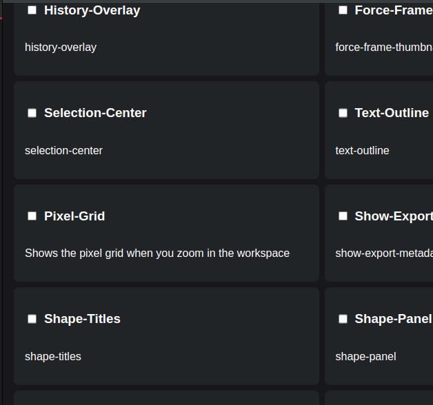
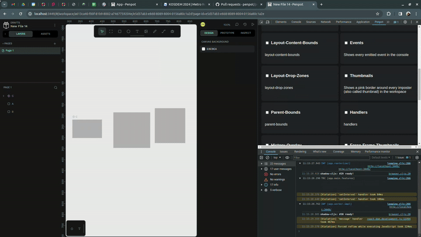
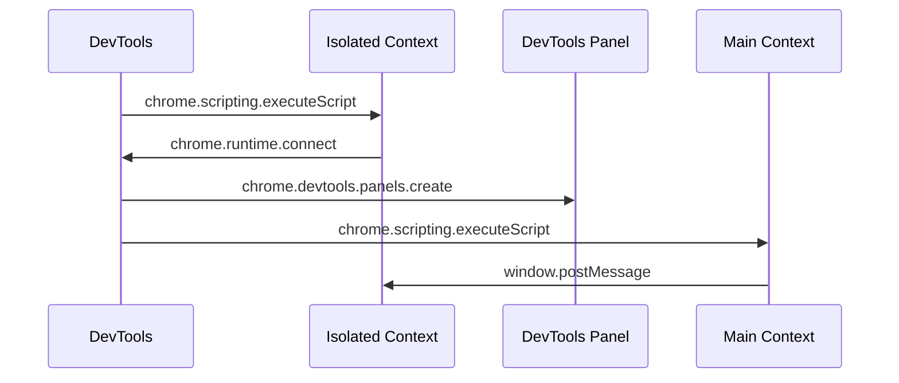
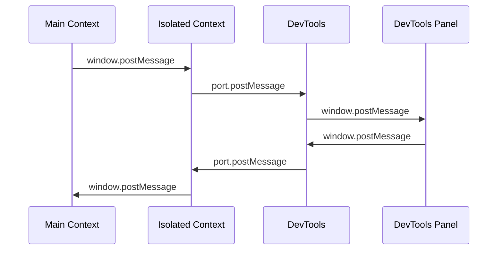

# Penpot DevTools

## What you can do

1. Use a ClojureScript REPL with direct access to app's current state.





2. Inspect current state (with specific type info).





3. Enable/Disable debug options.





## Known issues

1. Sometimes the DevTools panel gets disconnected from the main context (you can Reload frame inside DevTools to fix this).

## Initialization

1. Everytime we open DevTools in the specified URLs ([http://localhost:3449] or [https://design.penpot.dev]), the `devtools.html` is loaded, then `devtools.js` is loaded through the script tag.

2. `devtools.js` injects the `content-scripts/isolated.js` in an _Isolated Context_ (like an IFrame) in the target website, then this `isolated.js` connects to the devtools through `chrome.runtime.connect`

3. When `devtools.js` receives the connection, injects `content-scripts/main.js`, this script shares the same context as the Penpot App, so anything we execute in this context can access any of the exposed javascript APIs of the Penpot App.



## Permissions

This extension is limited to [http://localhost:3449] and [https://design.penpot.dev], any other URL will be excluded. Permissions should be the minimal to retrieve and send useful information to Penpot.

## Messaging

A message needs to be resend multiple times because of the browser isolated contexts.



## REPL

To implement the ClojureScript REPL we use a globally exposed function called `cljs_eval`. This function runs asynchronously and returns the result of the evaluated expression.

## Development

### Load unpacked extension

Go to [chrome://extensions] and click on **Load unpacked**, then select the folder of this repository (where this README.md is located) and click OK. If everything went ok, you should be able to see this extension in the list of installed extensions.

### Rebuild and refresh

If you modify a `content-script` or one of the main extension files: `devtools.html`, `devtools.js`, you only need to refresh the Extension by going to: [chrome://extensions] and clicking into the refresh button of the extension or on the **Update** button.

### Build

When you modify something related to the panel UI (anything inside the `src` folder), you need to rebuild the project and refresh (as explained in the previous entry).

```sh
corepack enable pnpm
pnpm install
pnpm build
```

If you need to debug the UI you can use `pnpm build:dev` to build it in `development` mode.
